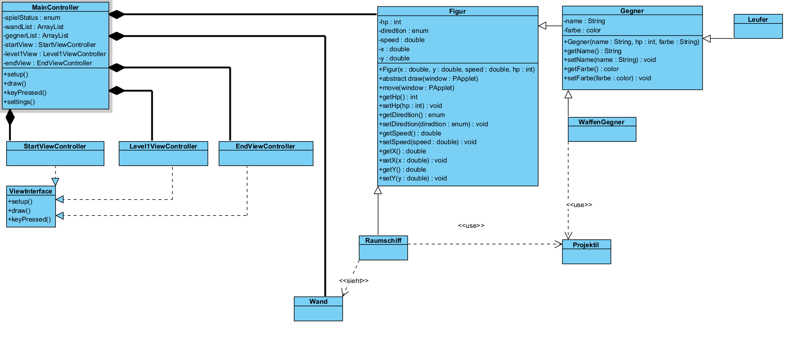
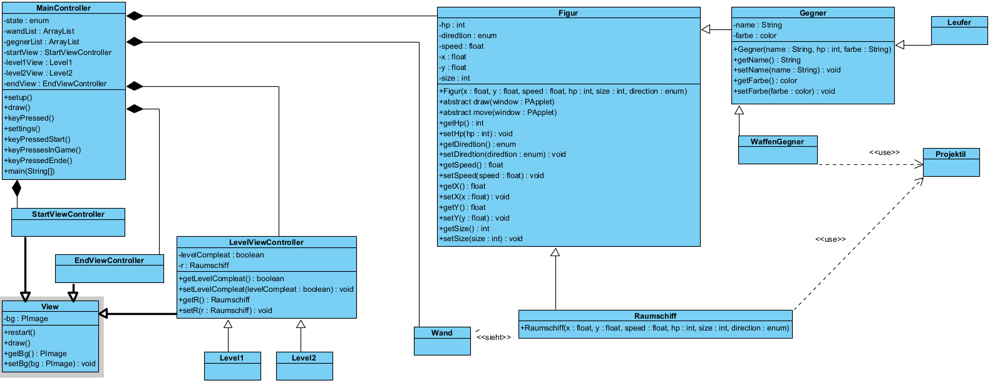

# M226B_SpaceShip

## M226B Projekt Dokumentation
### Inhalt
Informieren ...3
Planen.........3
Entscheiden ...3
Realisieren ...3
Kontrollieren .3
Auswerten .....3

### Informieren
#### Analysieren der Anforderungen
Mein Projekt ist ein Spiel wo ein SpaceShip wo durch ein Labyrinth fliegen muss und Gegner abschiessen muss. Und zum Ausgang finden muss. Dann gibt es W�nde und verschiedene G�nge und ein Paar verschiedenen Level. Und verschiedene Gegner mit verschiedenen F�higkeiten. Vielleicht wird es auch nicht so kompliziert wen es mich �berfordert.

### Planen

#### Zeitplan
Stand 13-12-2021
[Erstes Classen-Diagramm](Zeitplan/Zeitplan_2021-12-13.pdf)

#### Klassen-Diagramm
Stand 06-12-2021


Stand 09-12-2021


### Entscheiden

### Realisieren

#### Code-Snippets

##### Vererbung von Figur nach Raumschiff

Das ist die ganze Raumschiff Klasse.

```
package model;

import processing.core.PApplet;
import processing.core.PImage;

public class Raumschiff extends Figur{

	public Raumschiff(int hp, float speed, float x, float y, Direction direction) {
		super(hp, speed, 50, x, y, direction);
	}

	@Override
	public void draw(PApplet window) {
		PImage img = null;
		switch (getDirection()) {
		case N: img = window.loadImage("/img/spaceship_N.png"); break; 
		case E: img = window.loadImage("/img/spaceship_E.png"); break; 
		case S: img = window.loadImage("/img/spaceship_S.png"); break; 
		case W: img = window.loadImage("/img/spaceship_W.png"); break; 			
		}
		window.image(img, getX(), getY());
	}

	@Override
	public void move(PApplet window) {
		switch(direction) {
		case N: setY(Math.max(0, getY() - getSpeed())); break;
		case E: setX(Math.min(window.width - getSize(), getX() + getSpeed())); break;
		case S: setY(Math.min(window.height - getSize(), getY() + getSpeed())); break;
		case W: setX(Math.max(0, getX() - getSpeed())); break;
		}
	}

}
```

##### Abstrakte Klasse View

Das ist die Ganze View Klasse

```
package controller;

import processing.core.PApplet;
import processing.core.PImage;

/**
 * Dieses abstrakte Classe ist für alle Views zuständig.
 * @author Wendelin
 *
 */
public abstract class View {
	
	private PImage bg;

	public abstract void restart(PApplet window);
	public abstract void draw(PApplet window);
	
	/**
	 * @return the bg
	 */
	public PImage getBg() {
		return bg;
	}
	/**
	 * @param bg the bg to set
	 */
	public void setBg(PImage bg) {
		this.bg = bg;
	}

}
```

### Kontrollieren

### Auswerten
