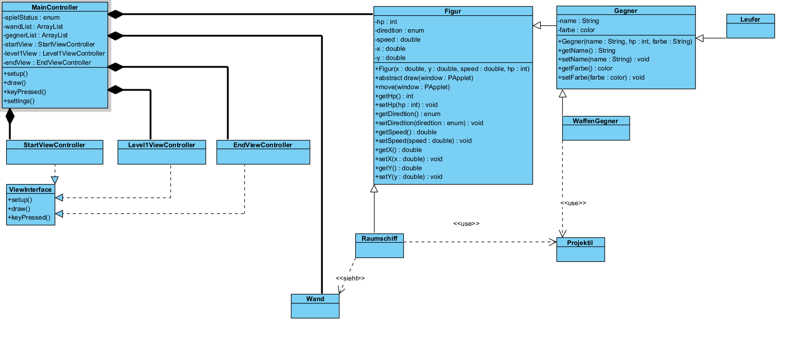

# M226B_SpaceShip

## M226B Projekt Dokumentation
### Inhalt
Informieren ...3
Planen.........3
Entscheiden ...3
Realisieren ...3
Kontrollieren .3
Auswerten .....3

### Informieren
#### Analysieren der Anforderungen
Mein Projekt ist ein Spiel wo ein SpaceShip wo durch ein Labyrinth fliegen muss und Gegner abschiessen muss. Und zum Ausgang finden muss. Dann gibt es Wände und verschiedene Gänge und ein Paar verschiedenen Level. Und verschiedene Gegner mit verschiedenen Fähigkeiten. Vielleicht wird es auch nicht so kompliziert wen es mich überfordert.

### Planen

### Entscheiden

### Realisieren

### Kontrollieren

### Auswerten
